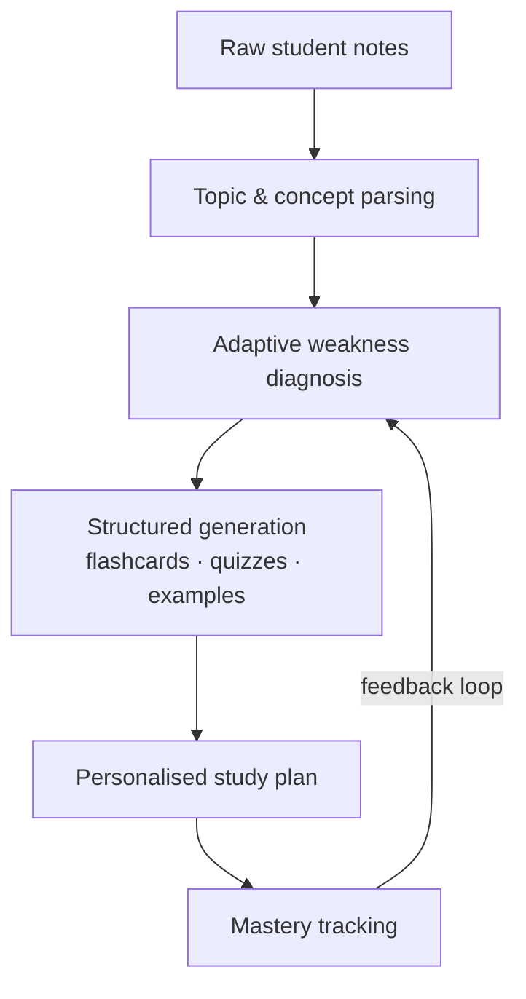

<!--
  AI-Exam-Coach · README template — "Clean Pro" edition
  Replace into: ap1807/AI-Exam-Coach/README.md
  Adjust file paths / commands in Quickstart to match your actual project layout.
-->

<h1 align="center">AI Exam Coach</h1>

<p align="center">
  <strong>Turns raw lecture notes into a complete, personalised study system — powered by Gemini.</strong>
</p>

<p align="center">
  
  
  
  <a href="LICENSE"></a>
</p>

---

## Overview

Students don't struggle because notes are missing — they struggle because notes are
**flat**. AI Exam Coach ingests raw study material and rebuilds it into an adaptive
learning loop: it identifies weak topics, generates targeted practice, and tracks what
you actually retain. Instead of re-reading the same 40 pages, you drill exactly where
you are weakest, in the format that works for you.

Built with **Gemini 3 Pro** in Google AI Studio, with structured output so every
flashcard, quiz item, and study plan is machine-checkable — not freeform prose.

## What it does

| Stage | Output |
|---|---|
| **Ingest** | Upload notes — the coach maps them into topics and concepts |
| **Diagnose** | Quick adaptive probe pinpoints weak topics per concept |
| **Generate** | Flashcards, MCQ quizzes, and worked examples targeted at those gaps |
| **Plan** | A day-wise revision plan weighted by weakness and exam date |
| **Track** | Mastery score per topic updates as you practice |

## How it works



## Quickstart

```bash
# 1. Clone and enter the project
git clone https://github.com/ap1807/AI-Exam-Coach.git
cd AI-Exam-Coach

# 2. Install dependencies
npm install

# 3. Add your Gemini API key
cp .env.local.example .env.local   # then edit .env.local → GEMINI_API_KEY=...

# 4. Run the dev server
npm run dev
```

> **Note** — built and tested with Google AI Studio; get a free API key at
> [aistudio.google.com](https://aistudio.google.com/).

## Project structure

```text
AI-Exam-Coach/
├── src/                    # Application source (TypeScript)
├── components/             # UI components
├── lib/                    # Gemini client, prompt & parsing logic
├── .env.local.example      # GEMINI_API_KEY placeholder
└── README.md
```

## Roadmap

- [ ] Multi-exam mode (JEE / semester finals / certifications)
- [ ] Spaced-repetition scheduling (SM-2)
- [ ] Collaborative study rooms
- [ ] Deployed demo link

## Connect

Built by [Adityaraj Patil](https://github.com/ap1807) ·
[Portfolio](https://www.aiwithadi.in) ·
[LinkedIn](https://www.linkedin.com/in/-adityaraj-patil18)

If this project helped you, consider starring the repo — it genuinely helps visibility.
